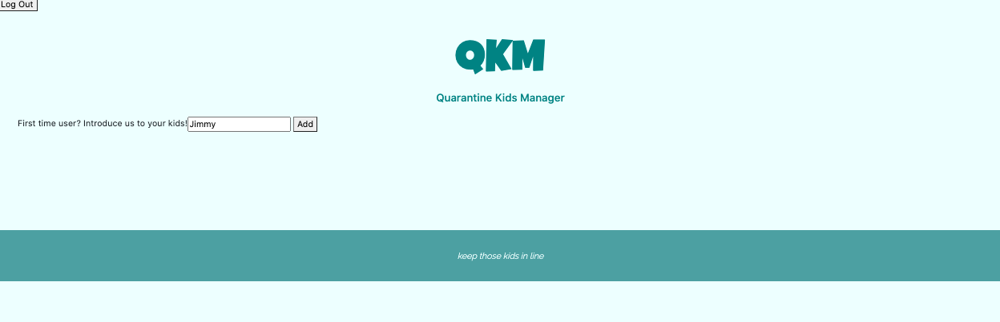
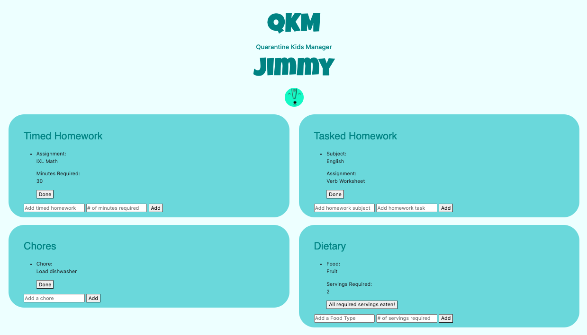

# QKM

Created as part of a team of 3 developers.  Quarantine Kids Manager is an app designed to help parents track various aspects of their children’s day, especially while at home during the COVID-19 pandemic.  Parents can use the app to track homework assignments, chores, and nutritional requirements.  Simply create your account, login, add a child, and add their required tasks for the day.  Tasks can be be marked "Done" once completed!  

Created using Express, Handlebars, Javascript, CSS, Bootstrap, SQL, Sequelize, and, AJAX. 

